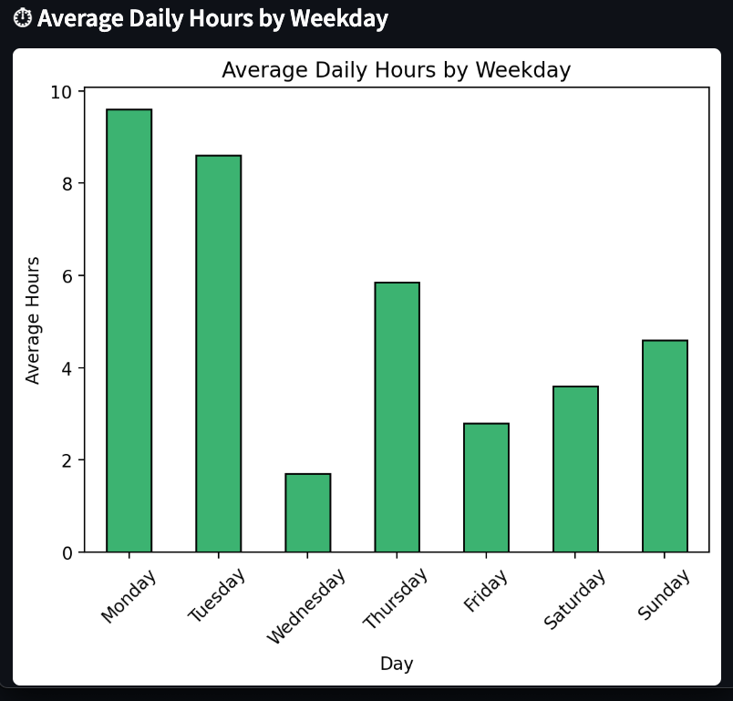
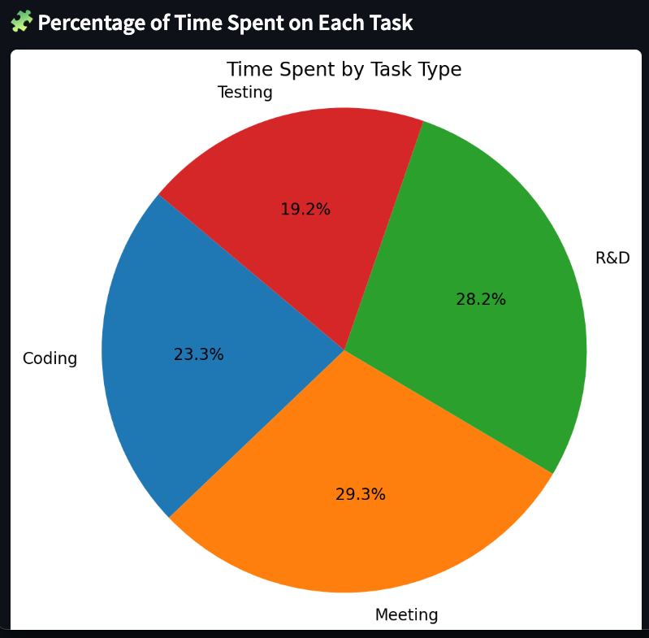
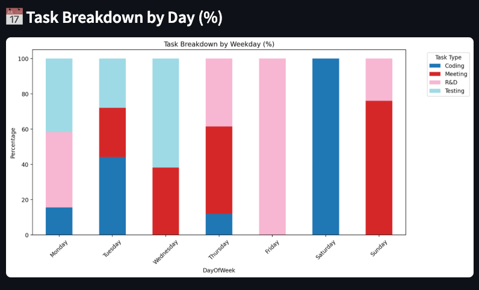
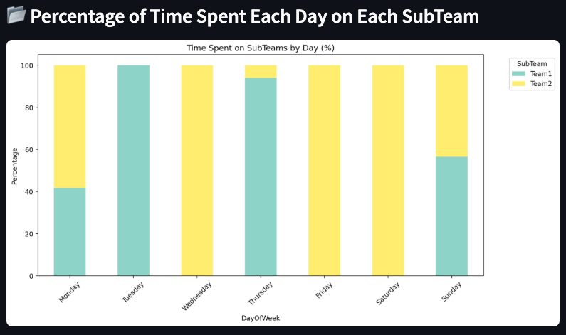
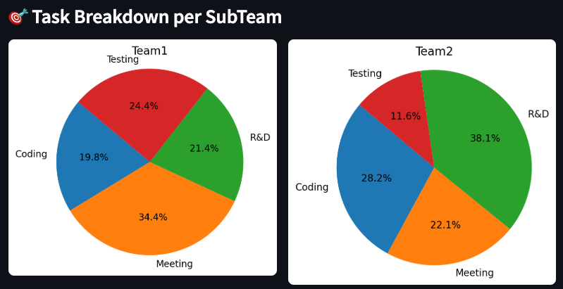

# 📊 Project Logs Analyzer

A simple Streamlit app to analyze and visualize your work logs from CSV files. This tool gives you insights into how your time is spent across days, tasks, and subteams.

---

## 🚀 Features

The app provides multiple visualizations based on your uploaded project logs files:

### 📅 1. Average Hours per Day of the Week
A bar chart showing how many hours you typically work on each weekday.



### 📘 2. Percentage of Time Spent on Each Task Type
A pie chart showing how your overall time is divided among different task types.



### 📈 3. Task Type Breakdown by Weekday
A stacked bar chart showing what percentage of your time each weekday goes into which task.



### 👥 4. Percentage of Time Spent Each Day on Each SubTeam
A stacked bar chart showing which subteams you worked on each weekday.



### 🔍 5. Task Breakdown for Each SubTeam
Multiple pie charts displayed side-by-side showing how time is distributed across tasks for each subteam.



---

## 📝 Input Format

Upload one or more CSV files with the following columns:

- `Person`
- `Team`
- `SubTeam`
- `Date`
- `Hours`
- `Description` (Tasks should be written in square brackets, like `[Coding] - Fixed issue...`)

---

## ⚙️ How to Run

### 1. Clone the repo (or download the script)

```bash
git clone https://github.com/your-username/time-log-analyzer.git
cd time-log-analyzer
```

### 2. Install dependencies

```bash
pip install -r requirements.txt
```

### 3. Run the Streamlit app

```bash
streamlit run app.py
```

---

## 📂 Example Usage

- Drag and drop one or more CSV log files into the app.
- The charts will be rendered based on the data in those files.
- If a required column is missing, the app will display a helpful error message.
